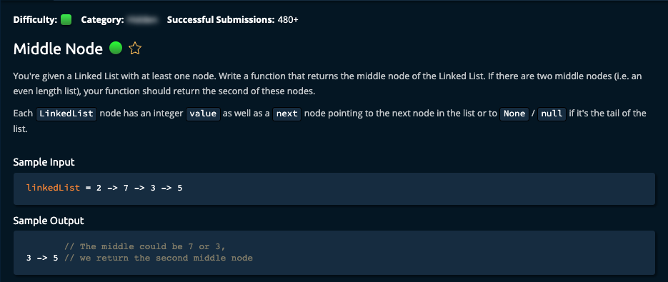

# Middle Node




* n, 1

```jsx
// This is an input class. Do not edit.
class LinkedList {
  constructor(value) {
    this.value = value;
    this.next = null;
  }
}

exports.LinkedList = LinkedList;

function middleNode(linkedList) {
  
  let count = 0;
  let slow = linkedList;
  let fast = linkedList;
  while (fast.next !== null && fast.next.next !== null) {
    slow = slow.next;
    fast = fast.next.next;

    count++;
  }

  if (fast.next === null) return slow;
  
  return slow.next;
}

// Do not edit the line below.
exports.middleNode = middleNode;
```
